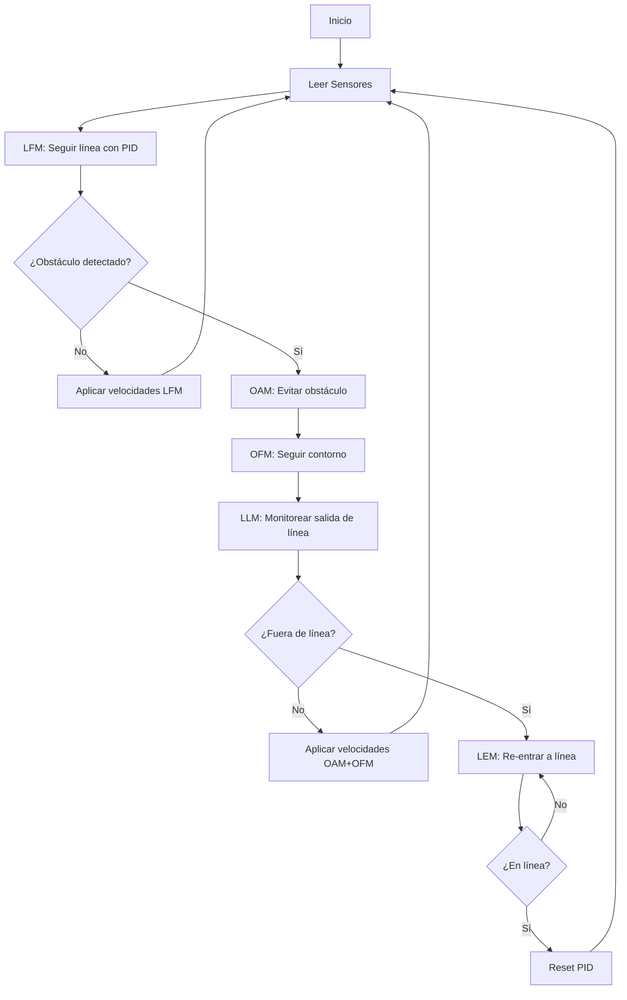

# weboot_Robot_seguir_linea_PID

# Robot E-puck: Seguidor de Línea con Control PID

## 📋 Descripción

Este proyecto implementa un sistema de control para un robot e-puck que sigue una línea negra mientras evita obstáculos. El sistema utiliza una **Arquitectura de Subsunción** combinada con un **controlador PID** para un seguimiento preciso y suave de la línea.

## 🎯 Características

- ✅ Seguimiento de línea con control PID completo
- ✅ Detección y evasión de obstáculos
- ✅ Re-entrada automática a la línea después de evitar obstáculos
- ✅ Arquitectura de Subsunción (Brooks)
- ✅ Compatible con simulación y robot real

## 🏗️ Arquitectura del Sistema

### Arquitectura de Subsunción

El robot utiliza múltiples módulos de comportamiento organizados en capas jerárquicas, donde los comportamientos de mayor prioridad pueden suprimir a los de menor prioridad:
```
┌─────────────────────────────────────┐
│  Capa 3: LEM (Line Entering)        │  ← Mayor Prioridad
│  Re-entrada a la línea               │
├─────────────────────────────────────┤
│  Capa 2: OAM + OFM                   │
│  Evitar/Seguir obstáculos            │
├─────────────────────────────────────┤
│  Capa 1: LFM (Line Following)        │  ← Menor Prioridad
│  Seguimiento de línea con PID        │
└─────────────────────────────────────┘
```

### Módulos de Comportamiento

#### 1. **LFM - Line Following Module**
Implementa un **controlador PID completo** para seguir la línea negra:
```c
PID_output = Kp × error + Ki × ∫error dt + Kd × d(error)/dt
```

**Componentes:**
- **Proporcional (P):** Respuesta inmediata al error actual
- **Integral (I):** Elimina errores acumulados en el tiempo
- **Derivativo (D):** Predice y suaviza cambios bruscos

#### 2. **OAM - Obstacle Avoidance Module**
- Detecta obstáculos usando 8 sensores de proximidad IR
- Identifica el lado del obstáculo (izquierda/derecha)
- Genera velocidades para alejarse del obstáculo

#### 3. **LLM - Line Leaving Module**
- Monitorea cuando el robot abandona la línea
- Señala eventos a otros módulos
- Resetea el PID al salir de la línea

#### 4. **OFM - Obstacle Following Module**
- Genera tendencia de giro hacia el lado del obstáculo
- Junto con OAM, crea comportamiento de "rodear obstáculo"

#### 5. **LEM - Line Entering Module**
- Máquina de estados finitos con 4 estados
- Maneja la re-entrada a la línea después de evitar obstáculos
- Resetea el PID al volver a la línea

## 🔧 Control PID

### Parámetros del Controlador
```c
#define KP 0.4      // Ganancia Proporcional
#define KI 0.001    // Ganancia Integral
#define KD 2.0      // Ganancia Derivativa
```

### Funcionamiento

1. **Error:** Diferencia entre sensores de suelo derecho e izquierdo
```c
   error = gs_value[GS_RIGHT] - gs_value[GS_LEFT]
```

2. **Término Proporcional:** Corrección inmediata
```c
   P = KP × error
```

3. **Término Integral:** Corrección de errores acumulados
```c
   integral += error × dt
   I = KI × integral
```

4. **Término Derivativo:** Predicción de tendencia
```c
   derivative = (error - previous_error) / dt
   D = KD × derivative
```

5. **Salida Total:**
```c
   correction = P + I + D
   left_speed = BASE_SPEED - correction
   right_speed = BASE_SPEED + correction
```

### Anti-Windup

El sistema incluye protección contra saturación del término integral:
```c
#define INTEGRAL_LIMIT 1000

if (integral > INTEGRAL_LIMIT)
    integral = INTEGRAL_LIMIT;
else if (integral < -INTEGRAL_LIMIT)
    integral = -INTEGRAL_LIMIT;
```

## 📊 Sensores

### Sensores de Proximidad (8)
- **ps0-ps3:** Lado derecho (0°, 45°, 90°, trasero)
- **ps4-ps7:** Lado izquierdo (trasero, 90°, 45°, 0°)
- **Umbral de detección:** 100 unidades

### Sensores de Suelo (3)
- **gs0:** Izquierdo
- **gs1:** Centro
- **gs2:** Derecho
- **Umbral blanco/negro:** ~500-900 unidades

## 🚀 Uso

### Compilación
```bash
# En Webots, el código se compila automáticamente
# O usar el compilador de C de tu sistema
gcc -o epuck_controller epuck_controller.c -lwebots
```

### Ejecución

1. Abrir el mundo en Webots
2. Cargar el controlador en el robot e-puck
3. Ejecutar la simulación

### Ajuste de Parámetros PID

Para optimizar el comportamiento, ajusta las constantes según la respuesta:

| Problema | Solución |
|----------|----------|
| Robot oscila mucho | Reducir **KP** o aumentar **KD** |
| No sigue bien las curvas | Aumentar **KP** |
| Error persistente en rectas | Aumentar **KI** (cuidado con overshooting) |
| Respuesta muy lenta | Aumentar **KP** y **KD** |
| Vibraciones/ruido | Reducir **KD** |

### Método de Ajuste Sugerido

1. **Empezar con KI = 0, KD = 0**
2. **Aumentar KP** hasta que siga la línea con oscilación
3. **Añadir KD** para reducir oscilaciones
4. **Añadir KI** (pequeño) para eliminar error residual
5. **Ajustar finamente** todos los parámetros

## 📁 Estructura del Código
```
├── Definiciones globales
│   ├── Constantes (TIME_STEP, sensores, etc.)
│   └── Variables de sensores y motores
│
├── Módulos de Comportamiento
│   ├── LineFollowingModule() [CON PID]
│   ├── ObstacleAvoidanceModule()
│   ├── LineLeavingModule()
│   ├── ObstacleFollowingModule()
│   └── LineEnteringModule()
│
├── Funciones auxiliares
│   └── ResetPID()
│
└── main()
    ├── Inicialización
    ├── Loop principal
    │   ├── Lectura de sensores
    │   ├── Ejecución de módulos
    │   ├── Supresión de comportamientos
    │   └── Aplicación de velocidades
    └── Debug
```

## 🔬 Flujo de Ejecución


## 📈 Ventajas del Control PID

| Característica | Sin PID | Con PID |
|----------------|---------|---------|
| Seguimiento de curvas | Regular | Excelente |
| Estabilidad | Media | Alta |
| Error residual | Presente | Minimizado |
| Oscilaciones | Frecuentes | Reducidas |
| Respuesta a perturbaciones | Lenta | Rápida |

## 🛠️ Requisitos

- **Software:** Webots R2023b o superior
- **Robot:** E-puck (simulado o real)
- **Sensores requeridos:**
  - 8 sensores de distancia IR
  - 3 sensores de suelo
  - 2 motores de ruedas

## 📝 Notas Técnicas

### Periodo de Muestreo
```c
#define TIME_STEP 32  // [ms]
dt = 32 / 1000.0      // 0.032 segundos
```

### Conversión de Velocidad
```c
// Velocidad en el motor = velocidad_calculada × 0.00628
wb_motor_set_velocity(left_motor, 0.00628 * speed[LEFT]);
```

### Estados del LEM
```c
LEM_STATE_STANDBY          // 0: En espera
LEM_STATE_LOOKING_FOR_LINE // 1: Buscando línea
LEM_STATE_LINE_DETECTED    // 2: Línea detectada
LEM_STATE_ON_LINE          // 3: Sobre la línea
```

## 🐛 Depuración

El código incluye salida de depuración:
```c
printf("OAM %d side %d   LLM %d inibitA %d   OFM %d   LEM %d state %d\n",
       oam_active, oam_side, llm_active, llm_inibit_ofm_speed,
       ofm_active, lem_active, lem_state);
```

Para activar debug del PID, descomentar en `LineFollowingModule()`:
```c
printf("PID: P=%.2f I=%.2f D=%.2f Output=%.2f\n", P, I, D, pid_output);
```

## 📚 Referencias

- **Arquitectura de Subsunción:** Brooks, R. A. (1986). "A Robust Layered Control System for a Mobile Robot"
- **Control PID:** Åström, K. J., & Hägglund, T. (1995). "PID Controllers: Theory, Design, and Tuning"
- **Webots:** https://cyberbotics.com/

## 👨‍💻 Autor

[Tu nombre]

## 📄 Licencia
```
Copyright 1996-2024 Cyberbotics Ltd.

Licensed under the Apache License, Version 2.0
```

---

## 🔗 Enlaces Útiles

- [Documentación de Webots](https://cyberbotics.com/doc/guide/index)
- [E-puck Robot](https://www.gctronic.com/doc/index.php/E-Puck)
- [Tutorial PID Control](https://en.wikipedia.org/wiki/PID_controller)

---

**⭐ Si este proyecto te fue útil, dale una estrella!**
